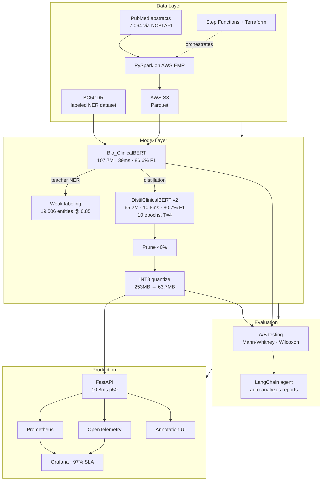

# clinical-nlp-optimization

An end-to-end ML engineering project built around one use case: clinical Named Entity Recognition for PHI detection. The idea was to take a large clinical BERT model, compress it as much as possible while keeping accuracy acceptable, and deploy it in a way that PHI never leaves the local device.

It covers knowledge distillation, distributed data processing, model optimization (pruning + quantization), A/B testing, a LangChain evaluation agent, and a production observability stack.

---

[](https://python.org)
[](https://pytorch.org)
[](https://huggingface.co)
[](https://aws.amazon.com)
[](https://onnxruntime.ai)
[](https://fastapi.tiangolo.com)
[](https://spark.apache.org)

[](https://langchain.com)
[](https://prometheus.io)
[](https://opentelemetry.io)
[](https://grafana.com)
[](https://terraform.io)
[](https://docker.com)

[](./distillation/results)
[](./observability/results)
[](./observability/results)
[](https://github.com/SantoshAdabala/clinical-nlp-optimization/commits/main)
[](https://github.com/SantoshAdabala/clinical-nlp-optimization/stargazers)

---

## What it does

```
Input:  "Patient was prescribed metformin 500mg for type 2 diabetes"
Output: [metformin 500mg] → Chemical    [type 2 diabetes] → Disease
```

The pipeline trains on [BC5CDR](https://huggingface.co/datasets/tner/bc5cdr), a public biomedical NER dataset. Same entity types (Chemical, Disease) as real PHI detection, but no actual patient data — so it's safe to run and share.

---

## Results

### Distillation

The teacher is `Bio_ClinicalBERT` (107.7M params). I tried two student architectures:

- **Student v1** — generic `DistilBERT` fine-tuned for 5 epochs
- **Student v2** — `DistilClinicalBERT` (clinical pre-training) fine-tuned for 10 epochs with 10% warmup

| | Teacher | Student v1 | Student v2 |
|---|---|---|---|
| Parameters | 107.7M | 65.2M | 65.2M |
| Macro F1 | 86.57% | 76.06% | **80.70%** |
| Chemical F1 | 91.68% | 73.58% | **85.92%** |
| Disease F1 | 77.99% | 66.16% | **70.48%** |
| Latency | 39.0ms | 10.7ms | 10.8ms |
| Size | 410.9MB | 248.7MB | 248.7MB |
| F1 retention | — | 87.9% | **93.2%** |

The domain-matched student (v2) improved Macro F1 by +4.64% and Chemical Recall by +18.92% over the generic student. Switching the student base model mattered more than any hyperparameter change.

### Model optimization

Pruning (40% sparsity) + INT8 quantization via ONNX Runtime:

**Teacher:**

| Variant | Macro F1 | Size | Latency |
|---|---|---|---|
| Baseline FP32 | 86.57% | 411MB | 30ms |
| Pruned 40% + recovery | 86.44% | 411MB | 29ms |
| INT8 | 85.80% | **103.5MB** | 83ms* |

**Student v2:**

| Variant | Size | Latency |
|---|---|---|
| Baseline ONNX FP32 | 253.3MB | 16.5ms |
| INT8 | **63.7MB** | 31.9ms* |

*INT8 is slower on macOS ARM — these kernels are optimized for x86 AVX-512. On an actual server (c5/c6i) you'd expect ~3× speedup.*

The 40% sparsity target was met with only 0.13% F1 drop on the teacher. Student quantization cuts size by ~75%.

### Distributed processing + weak labeling

Downloaded 7,064 PubMed abstracts via the NCBI API across 10 clinical search queries. Ran the teacher model over them to generate weak labels. High-confidence entities (threshold 0.85):

| | Count |
|---|---|
| Total entities generated | 28,415 |
| High-confidence (≥0.85) | **19,506** |
| Chemical | 9,109 |
| Disease | 10,397 |
| Runtime | 306.5 sec (23 docs/sec) |

The PySpark pipeline handles the full preprocessing stack — cleaning, tokenization, TF-IDF feature extraction, Parquet output. The local test runs on synthetic data; the EMR deployment scales this to arbitrary volume.

### A/B testing

Statistical comparison using Mann-Whitney and Wilcoxon signed-rank tests (100 samples, 95% CI):

**Teacher vs Student v2:**
- Student retains **88.1%** of teacher F1 (Wilcoxon p < 0.000001)
- Student is 1.9× faster (52.4ms → 28.0ms, Mann-Whitney p < 0.000001)
- Recommendation: deploy student

**Student v1 vs Student v2:**
- v2 outperforms v1 on F1 (p = 0.0001); no significant latency difference (p = 0.71)

### Observability

100-request load test, FastAPI server with Prometheus + OpenTelemetry:
- **97% SLA compliance** (97/100 requests under 50ms)
- 0 errors
- Latency range: 20.9ms – 56.3ms (two spikes above 50ms)

---

## System design



---

## Components

| # | What | Tech |
|---|---|---|
| 1 | Knowledge distillation | PyTorch, HuggingFace |
| 2 | Distributed pipeline + weak labeling | PySpark, AWS EMR, S3, Step Functions, Terraform |
| 3 | Pruning + INT8 quantization | ONNX Runtime, HuggingFace Optimum |
| 4 | Agentic evaluation | LangChain, Nvidia Nemotron via OpenRouter |
| 5 | A/B testing | scipy (Mann-Whitney, Wilcoxon) |
| 6 | Observability | FastAPI, Prometheus, OpenTelemetry, Grafana |

---

## Repo structure

```
clinical-nlp-optimization/
├── distillation/
│   ├── train_teacher.py        — fine-tune Bio_ClinicalBERT on BC5CDR
│   ├── distill.py              — student v1 (DistilBERT, 5 epochs)
│   ├── distill_v2.py           — student v2 (DistilClinicalBERT, 10 epochs) ← use this
│   ├── evaluate.py             — compare teacher vs students
│   └── results/
│
├── distributed-training/
│   ├── spark_pipeline.py       — PySpark pipeline (5 stages)
│   ├── pipeline_local.py       — local test with synthetic data
│   ├── deploy_emr.py           — AWS EMR deployment
│   ├── download_pubmed.py      — pull abstracts via NCBI API
│   ├── weak_label_pubmed.py    — run teacher NER on abstracts
│   ├── terraform/              — IaC for EMR cluster
│   └── results/
│
├── model-optimization/
│   ├── optimize.py             — prune → recovery fine-tune → INT8 quantize
│   ├── benchmark.py            — benchmark all variants
│   ├── kv_cache_quantization/  — PolarQuant (3-bit KV cache, experimental)
│   └── results/
│
├── agentic-workflows/
│   ├── agent.py                — LangChain agent (Nemotron via OpenRouter)
│   ├── tools.py                — 5 analysis tools
│   ├── run_tools.py            — run tools directly without LLM
│   └── results/
│
├── ab-testing/
│   ├── ab_test.py              — statistical comparison
│   └── results/                — teacher vs v2, v1 vs v2 reports + plots
│
├── observability/
│   ├── inference_server.py     — FastAPI with Prometheus + OTel
│   ├── metrics.py              — metric definitions
│   ├── logger.py               — structured JSON logging
│   ├── tracing.py              — OpenTelemetry setup
│   ├── test_client.py          — 100-request load test
│   ├── static/index.html       — annotation UI
│   ├── static/compare.html     — teacher vs student comparison
│   ├── grafana/dashboard.json  — Grafana dashboard
│   └── results/
│
└── README.md
```

---

## Running it

```bash
# Component 1: Distillation
cd distillation && pip install -r requirements.txt
python train_teacher.py        # ~15 min
python distill_v2.py           # ~40 min — recommended student
python evaluate.py

# Component 2: Distributed pipeline
cd ../distributed-training && pip install -r requirements.txt
python pipeline_local.py       # local test
python download_pubmed.py      # download abstracts
python weak_label_pubmed.py    # generate weak labels
# EMR: python deploy_emr.py (needs AWS creds + Terraform)

# Component 3: Model optimization
cd ../model-optimization && pip install -r requirements.txt
python optimize.py
python benchmark.py

# Component 4: Agentic evaluation
cd ../agentic-workflows && pip install -r requirements.txt
python run_tools.py            # no LLM needed
# export OPENROUTER_API_KEY=<key> && python agent.py

# Component 5: A/B testing
cd ../ab-testing && pip install -r requirements.txt
python ab_test.py --num-samples 100

# Component 6: Observability
cd ../observability && pip install -r requirements.txt
python inference_server.py     # terminal 1
python test_client.py          # terminal 2
# http://localhost:8000        — annotation UI
# http://localhost:8000/compare — teacher vs student
```

---

## Notes

- INT8 quantization target was <20ms latency for real-time point-of-care annotation. The student FP32 hits 10.8ms; INT8 is slower on macOS ARM (31.9ms) but should be faster on x86 AVX-512 server targets.
- The LangChain agent uses Nvidia Nemotron via OpenRouter — it's free and works fine for analyzing benchmark JSON outputs. Any tool-calling model works.
- `kv_cache_quantization/` contains PolarQuant, a 3-bit KV cache implementation I was experimenting with. It's separate from the main pipeline.
