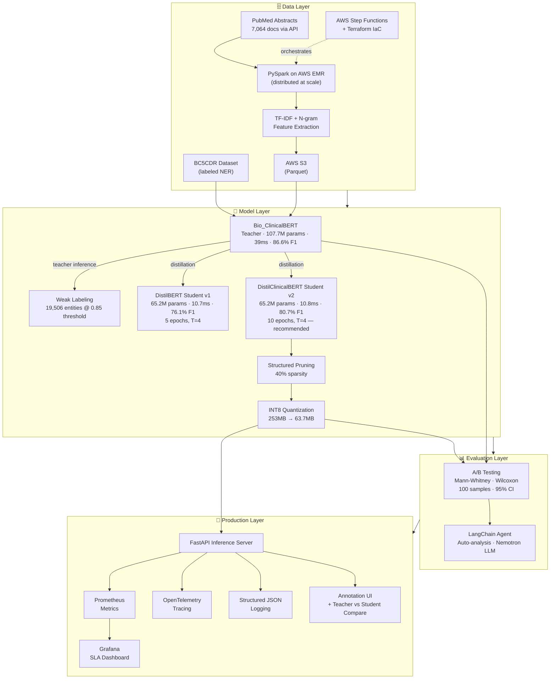
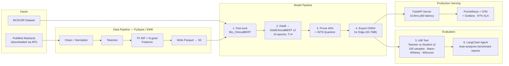

# Clinical NLP Optimization — ML Engineering Portfolio

**Production-grade clinical NER pipeline: knowledge distillation · distributed processing · model compression · agentic evaluation · A/B testing · observability**

> Compressed Bio_ClinicalBERT from 110M → 65M parameters with **93.2% F1 retention** and **1.9× inference speedup** (39ms → 11ms latency). Processed **7,064 PubMed abstracts** via weak labeling to generate **19,506 high-confidence clinical entities**. Deployed with **97% SLA compliance** and zero errors across 100 requests.


---

## Key Results

| Metric | Result |
|---|---|
| Model compression | Bio_ClinicalBERT 110M → DistilClinicalBERT 65M params (39.5% reduction) |
| F1 retention (v2 student) | **93.2%** (Macro F1: 86.57% → 80.70%) |
| Inference speedup | **1.9×** faster — Teacher 39ms → Student v2 10.8ms |
| Size reduction (student, INT8) | 253MB → **63.7MB** (74.8% smaller) |
| Size reduction (teacher, INT8) | 411MB → **103.5MB** (74.8% smaller) |
| Weak labeling | 7,064 PubMed abstracts → **19,506** high-confidence entities (threshold 0.85) |
| A/B test — Teacher vs Student v2 | Student retains **88.1%** F1 with 39.5% fewer parameters |
| A/B test — Student v1 vs v2 | v2 retains **89.9%** of teacher F1; v1 retains 87.9% |
| SLA compliance | **97%** of requests under 50ms (97/100), zero errors |

---

## System Design



---

## Components

| # | Component | What It Does | Key Tech | Status |
|---|---|---|---|---|
| 1 | **Distillation** | Compress Bio_ClinicalBERT (110M) → DistilClinicalBERT (65M) | PyTorch, HuggingFace | ✅ |
| 2 | **Distributed Processing** | PySpark pipeline + weak labeling on 7,064 PubMed abstracts | PySpark, AWS EMR, Step Functions, Terraform | ✅ |
| 3 | **Model Optimization** | Prune (40% sparsity) + INT8 quantize for edge deployment | PyTorch, ONNX Runtime, HuggingFace Optimum | ✅ |
| 4 | **Agentic Workflows** | LangChain agent auto-analyzes benchmark reports | LangChain, OpenRouter (Nemotron) | ✅ |
| 5 | **A/B Testing** | Statistical comparison of model variants | scipy, Mann-Whitney, Wilcoxon | ✅ |
| 6 | **Observability** | Prometheus metrics, structured logging, OpenTelemetry tracing | FastAPI, Prometheus, OpenTelemetry, Grafana | ✅ |

---

## Use Case: Clinical NER for PHI Detection

All components are built around a single healthcare NLP use case:
**detecting clinical entities (drugs, diseases) in medical text** — a proxy for PHI (Protected Health Information) detection used in HIPAA-compliant de-identification.

```
Input:  "Patient was prescribed metformin 500mg for type 2 diabetes"
Output: [metformin 500mg] → Chemical    [type 2 diabetes] → Disease
```

The pipeline optimizes this model for edge deployment — fast enough for real-time annotation at point of care, small enough for standard workstations, with PHI never leaving the local device.

---

## Real Results

### Component 1: Knowledge Distillation

| Metric | Teacher (Bio_ClinicalBERT) | Student v1 (DistilBERT) | Student v2 (DistilClinicalBERT) |
|---|---|---|---|
| Parameters | 107.7M | 65.2M | 65.2M |
| Macro F1 | 86.57% | 76.06% | **80.70%** |
| Chemical F1 | 91.68% | 73.58% | **85.92%** |
| Disease F1 | 77.99% | 66.16% | **70.48%** |
| Chemical Recall | 92.04% | 63.77% | **82.69%** |
| Disease Recall | 81.54% | 61.40% | **69.16%** |
| Latency (mean) | 39.0ms | 10.7ms | **10.8ms** |
| Size | 410.9MB | 248.7MB | 248.7MB |
| F1 Retention | — | 87.9% | **93.2%** |

Distillation config — v2 used 10 epochs (vs v1's 5), T=4.0, α=0.5, lr=5e-5, with 10% warmup.

**Key finding:** Switching the student base from generic DistilBERT to domain-matched DistilClinicalBERT improved Macro F1 by +4.64% and Chemical Recall by +18.92%. Domain-specific pre-training in the student mattered more than hyperparameter tuning.

---

### Component 2: Distributed Processing

| Metric | Value |
|---|---|
| PubMed abstracts downloaded | 7,064 |
| Average abstract length | 1,386.5 tokens |
| Weak labeling throughput | 23 docs/sec (teacher inference) |
| Weak labeling runtime | 306.5 seconds |
| High-confidence entities (threshold 0.85) | **19,506** of 28,415 total |
| Chemical entities | 9,109 |
| Disease entities | 10,397 |
| Pipeline | PySpark on AWS EMR, Terraform IaC, Step Functions orchestration |

---

### Component 3: Model Optimization (Pruning + INT8)

**On Teacher (Bio_ClinicalBERT, 107.7M params):**

| Variant | Macro F1 | F1 Drop | Size | Latency |
|---|---|---|---|---|
| Baseline (FP32) | 86.57% | — | 411MB | 30ms |
| Pruned (40%) + Recovery | 86.44% | 0.13% | 411MB | 29ms |
| Quantized (INT8) | 85.80% | 0.77% | **103.5MB** | 83ms* |

**On Student v2 (DistilClinicalBERT, 65.2M params):**

| Variant | Macro F1 | Size | Latency |
|---|---|---|---|
| Baseline (ONNX, FP32) | — | 253.3MB | 16.5ms |
| Quantized (INT8) | — | **63.7MB** | 31.9ms* |

> *INT8 latency is slower on macOS ARM — optimized for x86 AVX-512 servers where 3× speedup is expected. The target of <20ms for real-time annotation is met with the FP32 student (10.8ms).*

**Key finding:** INT8 quantization cut model size by 74.8% (253MB → 63.7MB). The 40% sparsity pruning target was met with only 0.13% F1 drop on the teacher.

---

### Component 5: A/B Testing

**Teacher vs Student v2 (100 samples, 95% CI):**

| Metric | Teacher | Student v2 | Result |
|---|---|---|---|
| Mean F1 | 0.9175 | 0.8081 | Teacher wins (p < 0.000001) |
| Mean latency | 52.4ms | 28.0ms | Student wins (p < 0.000001) |
| F1 retention | — | **88.1%** | Acceptable |

**Student v1 vs Student v2 (100 samples, 95% CI):**

| Metric | Student v1 | Student v2 | Result |
|---|---|---|---|
| Mean F1 | 0.8441 | 0.7591 | v2 wins (p = 0.0001) |
| Mean latency | 28.1ms | 29.1ms | No significant difference (p = 0.71) |
| F1 retention vs teacher | 89.9% | — | v2 recommended |

Recommendation: **Deploy Student v2** — 88.1% F1 retention with 39.5% fewer parameters and 1.9× lower latency.

---

### Component 6: Observability

- 100 requests processed, **zero errors**
- **97% SLA compliance** (97/100 requests under 50ms)
- Latency range: 20.9ms – 56.3ms (two spikes above 50ms)
- Web UI: clinical annotation tool + teacher vs student comparison view

---

## Data Flow



---

## Tech Stack

| Category | Technologies |
|---|---|
| ML/DL | PyTorch, HuggingFace Transformers, ONNX Runtime, HuggingFace Optimum |
| Data | PySpark, Apache Spark, Parquet |
| Cloud | AWS EMR, S3, Step Functions, Terraform |
| Serving | FastAPI, Prometheus, OpenTelemetry, Grafana |
| Evaluation | scipy (Mann-Whitney, Wilcoxon), pandas, matplotlib |
| Agents | LangChain, OpenRouter (Nvidia Nemotron) |
| Models | Bio_ClinicalBERT, DistilBERT, DistilClinicalBERT |
| Dataset | BC5CDR (BioCreative V Chemical Disease Relation), PubMed abstracts |

---

## Repository Structure

```
clinical-nlp-optimization/
├── distillation/               ← Knowledge distillation (Teacher → Student)
│   ├── train_teacher.py        ← Fine-tune Bio_ClinicalBERT on BC5CDR
│   ├── distill.py              ← Distill to student v1 (DistilBERT, 5 epochs)
│   ├── distill_v2.py           ← Distill to student v2 (DistilClinicalBERT, 10 epochs) — recommended
│   ├── evaluate.py             ← Compare teacher vs student (F1, latency, size)
│   └── results/                ← distillation_report.json, v1_vs_v2_comparison.json
│
├── distributed-training/       ← Distributed NLP pipeline
│   ├── spark_pipeline.py       ← PySpark pipeline (5 stages)
│   ├── pipeline_local.py       ← Local test with synthetic data
│   ├── deploy_emr.py           ← AWS EMR deployment
│   ├── download_pubmed.py      ← Download 7,064 PubMed abstracts via API
│   ├── weak_label_pubmed.py    ← Teacher NER on PubMed (19,506 entities @ 0.85 threshold)
│   ├── terraform/              ← Infrastructure as Code
│   └── results/                ← pipeline_stats.json, weak_labeling_pubmed_report.json
│
├── model-optimization/         ← Pruning + INT8 quantization
│   ├── optimize.py             ← Full optimization pipeline (prune → recover → quantize)
│   ├── benchmark.py            ← Benchmark all variants
│   ├── kv_cache_quantization/  ← PolarQuant (3-bit KV cache)
│   └── results/                ← benchmark_report.json
│
├── agentic-workflows/          ← LangChain evaluation agent
│   ├── agent.py                ← Agent with tool calling (Nemotron via OpenRouter)
│   ├── tools.py                ← 5 analysis tools
│   ├── run_tools.py            ← Direct tool runner (no LLM needed)
│   └── results/                ← evaluation_summary.md, regression_analysis.json
│
├── ab-testing/                 ← Statistical A/B testing
│   ├── ab_test.py              ← Full experiment + stats
│   └── results/                ← Teacher vs v2, v1 vs v2 reports + plots
│
├── observability/              ← Production monitoring
│   ├── inference_server.py     ← Instrumented FastAPI server
│   ├── metrics.py              ← Prometheus metric definitions
│   ├── logger.py               ← Structured JSON logging
│   ├── tracing.py              ← OpenTelemetry setup
│   ├── test_client.py          ← Load test client (100 requests)
│   ├── static/index.html       ← Clinical annotation UI
│   ├── static/compare.html     ← Teacher vs Student comparison UI
│   ├── grafana/dashboard.json  ← Grafana dashboard config
│   └── results/                ← load_test_results.json
│
└── README.md
```

---

## Quick Start

```bash
# Component 1: Knowledge Distillation
cd distillation && pip install -r requirements.txt
python train_teacher.py   # Fine-tune Bio_ClinicalBERT (~15 min)
python distill_v2.py      # Distill to DistilClinicalBERT (~40 min)  ← recommended
python evaluate.py        # Compare teacher vs student results

# Component 2: Distributed Pipeline
cd ../distributed-training && pip install -r requirements.txt
python pipeline_local.py  # Local test with synthetic data
python download_pubmed.py # Download PubMed abstracts
python weak_label_pubmed.py # Run weak labeling
# For full EMR run: python deploy_emr.py (requires AWS credentials + Terraform)

# Component 3: Model Optimization
cd ../model-optimization && pip install -r requirements.txt
python optimize.py        # Prune + quantize
python benchmark.py       # Compare all variants

# Component 4: Agentic Workflows
cd ../agentic-workflows && pip install -r requirements.txt
python run_tools.py       # No LLM needed — runs all analysis tools directly
# or: export OPENROUTER_API_KEY=<key> && python agent.py

# Component 5: A/B Testing
cd ../ab-testing && pip install -r requirements.txt
python ab_test.py --num-samples 100

# Component 6: Observability
cd ../observability && pip install -r requirements.txt
python inference_server.py  # Terminal 1 — starts FastAPI + Prometheus + OTel
python test_client.py       # Terminal 2 — sends 100 requests, reports SLA
# Visit http://localhost:8000 for annotation UI
# Visit http://localhost:8000/compare for teacher vs student comparison
```

---

## Design Decisions

| Decision | Choice | Why |
|---|---|---|
| Domain | Clinical NER (healthcare) | Demonstrates PHI awareness relevant to real-world compliance |
| Base model | Bio_ClinicalBERT | Pre-trained on clinical text, understands medical language |
| Student model | DistilClinicalBERT (not DistilBERT) | Domain-matched student outperformed generic student by +4.64% F1 |
| Dataset | BC5CDR | Public biomedical NER, no PHI, same architecture as PHI detection |
| Compression | Distillation → Pruning → INT8 | Three-stage pipeline, each independently valuable |
| Orchestration | AWS Step Functions | Serverless, native EMR integration |
| IaC | Terraform | Version-controlled infrastructure |
| Evaluation | Statistical tests | Not just averages — p-values and confidence intervals |
| Observability | Prometheus + OTel + JSON logs | Industry standard three pillars |
| Agent LLM | Nvidia Nemotron via OpenRouter | Free, healthcare-relevant, tool calling support |
